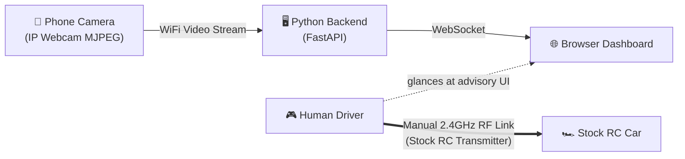

# 🏎️ RC Car Obstacle-Avoidance Co-Pilot (Hackathon Prototype)

An perception + advisory co-pilot system for an RC car using a single smartphone camera streaming MJPEG video over WiFi.

---

## 📌 System Architecture & Communication Boundaries



### ⚠️ STRICT COMMUNICATION SCOPE:
- **Single Inbound Network Link**: The ONLY network connection in this software system is `Phone (IP Webcam) --WiFi MJPEG--> Laptop`.
- **No Vehicle Connection**: There is **no API, WiFi/Bluetooth link, telemetry receiver, or motor control interface** between the backend/laptop and the RC car or its transmitter.
- **Backend Role**: The backend strictly functions as a perception and advisory engine. It never sends control signals or commands to the vehicle.
- **Human Actuation**: The human driver steers the RC car using the vehicle's stock handheld transmitter, referencing the on-screen co-pilot recommendations at their own discretion.

---

## 🚀 Quick Setup & Installation

### 1. Prerequisites & Virtual Environment
Ensure Python 3.9+ is installed:

```bash
# Clone/navigate to directory
cd c:\thrillcircuit

# Create virtual environment
python -m venv venv
# On Windows:
venv\Scripts\activate
# On Linux/macOS:
# source venv/bin/activate

# Install dependencies
pip install -r requirements.txt
```

---

## 📱 Setting Up IP Webcam App on Phone

1. Install the free **IP Webcam** app on Android (or any MJPEG stream app on iOS).
2. Connect your phone and laptop to the **same WiFi network**.
3. Open IP Webcam and tap **"Start server"** at the bottom.
4. Note the URL displayed on screen, e.g., `http://192.168.1.105:8080`.
5. The direct video stream endpoint is `http://<phone-ip>:8080/video`.

---

## ⚙️ Configuration

Settings can be configured in `config.py` or overridden via environment variables:

| Setting | Default Value | Environment Variable | Description |
|---|---|---|---|
| `STREAM_URL` | `http://192.168.1.100:8080/video` | `RC_STREAM_URL` | Phone IP Webcam video URL |
| `FRAME_WIDTH` | `640` | `RC_FRAME_WIDTH` | Input frame resize width |
| `FRAME_HEIGHT` | `480` | `RC_FRAME_HEIGHT` | Input frame resize height |
| `DETECTOR_TYPE` | `classical` | `RC_DETECTOR` | Vision backend (`classical` or `depth`) |
| `OBSTACLE_THRESHOLD` | `0.35` | `RC_OBSTACLE_THRESHOLD` | Obstacle density threshold for turn warning |
| `STOP_THRESHOLD` | `0.65` | `RC_STOP_THRESHOLD` | Threshold triggering full STOP recommendation |
| `HYSTERESIS_FRAMES` | `3` | `RC_HYSTERESIS_FRAMES` | Consecutive matching frames required before switching state |
| `SERVER_HOST` | `0.0.0.0` | `RC_HOST` | FastAPI bind address |
| `SERVER_PORT` | `8000` | `RC_PORT` | FastAPI server port |

---

## 🏃 Running the Server & Dashboard

### Start Server with Live Stream:
```bash
# Set your phone IP stream URL
set RC_STREAM_URL=http://192.168.20.182:8080/video

# Start server
python -m server.main
```

> **Note on Offline / Test Mode**: If the phone stream is unreachable or offline, StreamReader automatically generates an animated synthetic stream with a simulated obstacle so you can test the dashboard end-to-end without a phone connected!

### Open Dashboard:
Open your browser and navigate to:
```
http://localhost:8000/
```
(Or `http://<laptop-ip>:8000/` from a tablet mounted near the driver).

---

## 🧠 Swapping Classical Detector for Monocular Depth Model

The project includes two swappable vision backends:
1. **Classical OpenCV Detector (`classical`)**: Uses edge density & spatial texture gradients. Requires **no GPU, no model downloads, works 100% offline out of the box**.
2. **Monocular Depth Detector (`depth`)**: Backed by **MiDaS-small** PyTorch model. Performs relative depth estimation to detect physical obstacles.

### How to Enable Depth Model Detector:
1. Install PyTorch & torchvision:
   ```bash
   pip install torch torchvision timm
   ```
2. Set the environment variable `RC_DETECTOR=depth` before launching:
   ```bash
   set RC_DETECTOR=depth
   python -m server.main
   ```

---

## 🎯 Intended Driver Co-Pilot Usage Pattern

1. Mount the smartphone securely onto the front of the RC car chassis.
2. Position your laptop or tablet near the human driver (or have a spotter call out directions).
3. **Operational Scope**: This application **only consumes phone video and displays advisory guidance** on screen. All vehicle steering, throttle, and braking control are completely manual via the RC transmitter and entirely unconnected to this application.
4. The dashboard displays giant glanceable arrows:
   - 🟢 **FORWARD (↑)**: Clear path ahead.
   - 🟠 **TURN LEFT (↖) / TURN RIGHT (↗)**: Obstacle ahead in center, side path clear.
   - 🔴 **STOP (🛑)**: Obstacle blocking forward path with no clear escape.
5. The driver uses the live visual cues to steer the vehicle safely around obstacles using the standard RC transmitter!
